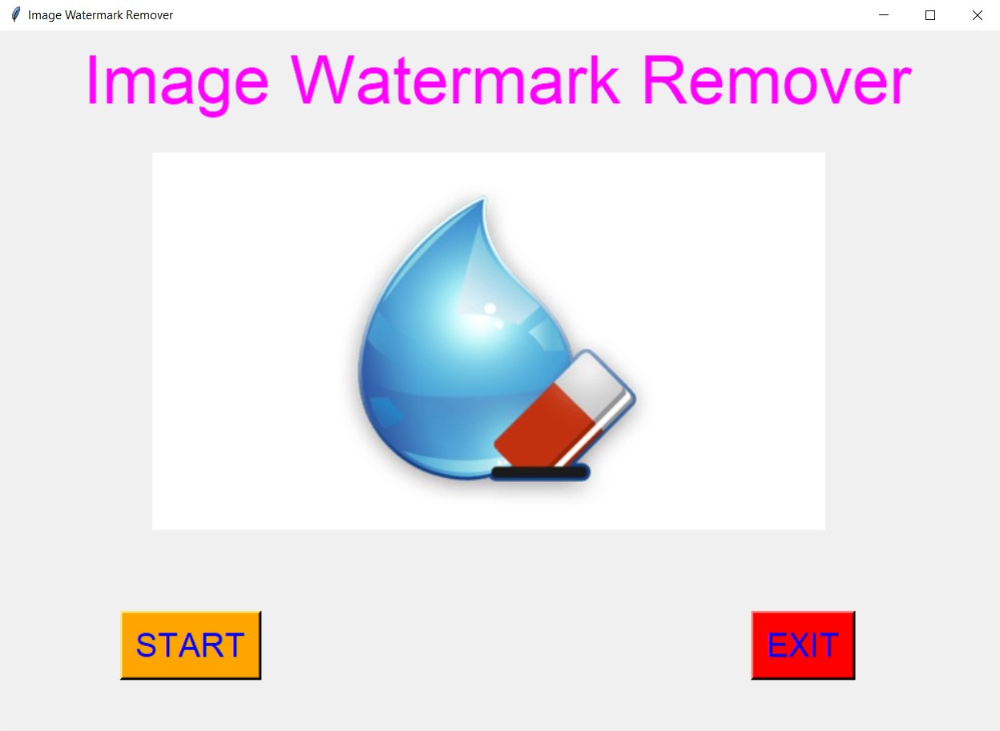
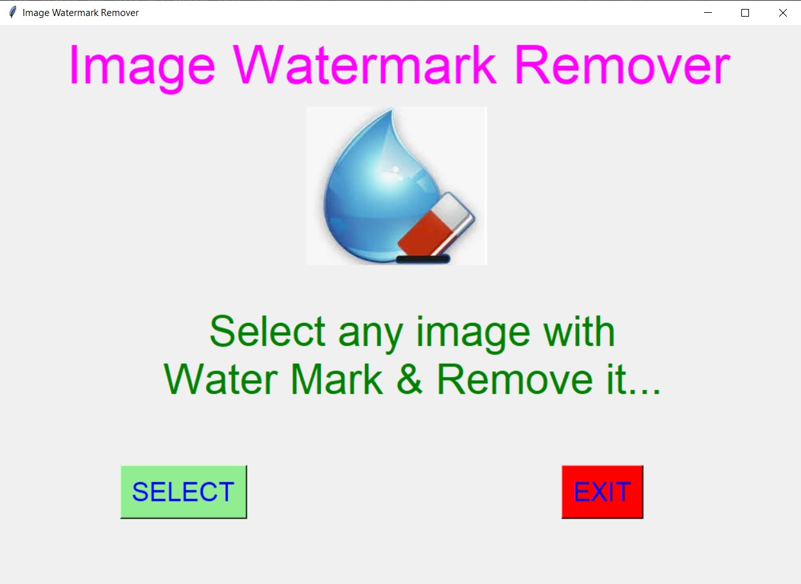
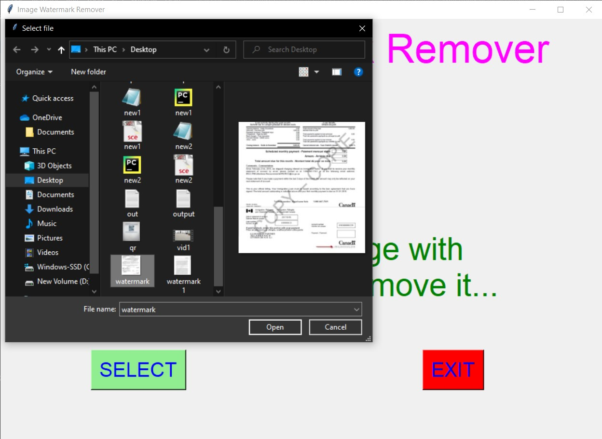
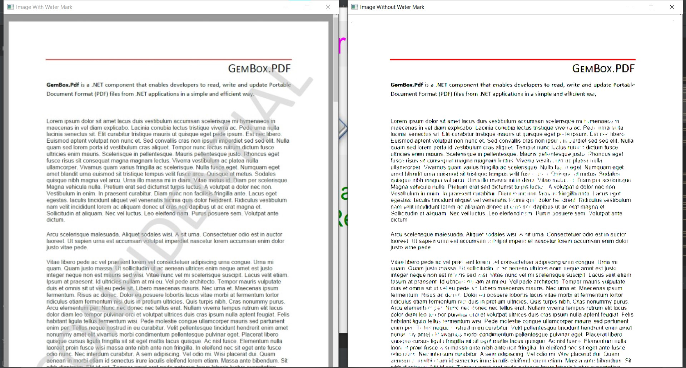
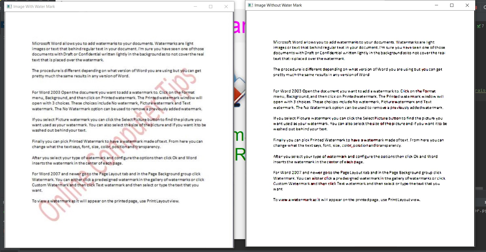

## ✔ IMAGE WATERMARK REMOVER
- An Image Watermark Remover is an application created in python with tkinter gui and OpenCv library.
- In this application user can select any image with watermark in it and will be able to remove the watermark from that selected image.
- Also user will be shown both the image with watermark and the image without watermark as an output.
- User can also save that snipped image any where on local system by using save command.
- For implementing this used OpenCv library.

	
	
	
	

	
	
	
	

	
	
	
	

	
	
	
	
	
	

	

****

### 📌REQUIREMENTS :
- python 3
- cv2 module
- tkinter module
- filedialog from tkinter
- messagebox
- from PIL import Image, ImageTk

****

### 📌HOW TO Use it :
- User just need to download the file, and run the image_watermark_remover.py, on local system.
- After running a GUI window appears, where user can start the application of removing watermark by clicking on the START button.
- After that a new GUI window will open, in which user will have buttons like SELECT and EXIT.
- User can select any image file with watermark in it from the local system, using SELECT button.
- After that user will be able to see both the image with watermark and image without watermark as an output.
- User can also save that image without watermark any where on local system by using save command.

### 📌Purpose :
- This scripts helps user to easily remove the water mark present in the image.

### 📌Compilation Steps :
- Install tkinter, PIL, cv2
- After that download the code file, and run image_watermark_remover.py on local system.
- Then the script will start running and user can explore it by selecting any image with watermark in it and removing it.

****

### 📌SCREENSHOTS :

   
   
   
   
   
   

****

### 🌟Stargazers Over Time:

****

### 🌟Forkers Over Time:

****

### 📌Contributors:

